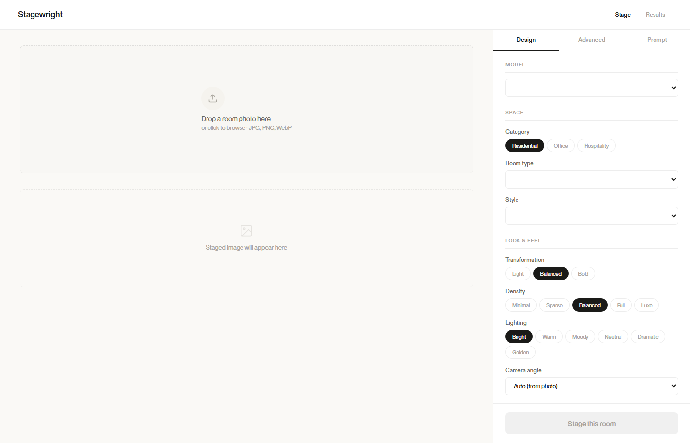
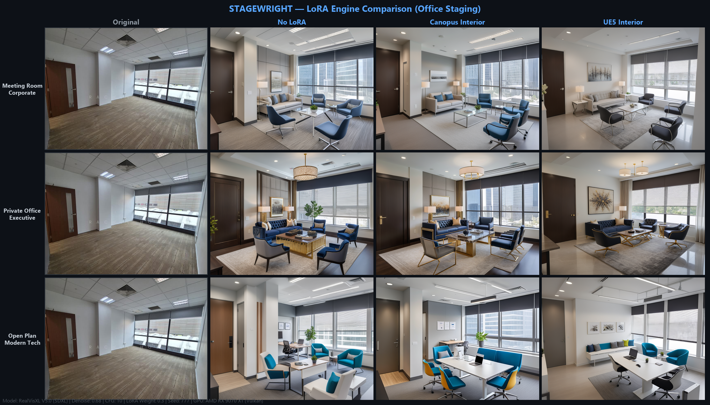

# Stagewright — AI Virtual Staging

Local, fully-offline AI virtual staging for real estate photos. Drop in a photo of an empty room, pick a room type, design style, furniture density and lighting mood, and get back a photorealistic furnished version of the same space — with a before/after comparison slider and a "VIRTUALLY STAGED" watermark toggle for listing-disclosure compliance (PropertyGuru / 99.co).

> **Note:** This is a portfolio showcase. The source code lives in a private repository.



## What it does

- **Img2img staging** — upload an unfurnished room photo, get a furnished render that preserves the room's geometry
- **Singapore-oriented presets** — Residential (HDB / condo / landed), Office and Hospitality room types with matching design styles
- **Full creative control** — furniture density, lighting mood, camera angle, material emphasis, transformation intensity (mapped to denoise strength), custom prompt text, seed re-roll
- **LoRA style enhancers** — stackable interior-architecture LoRAs for sharper, more coherent interiors
- **Compliance-ready output** — optional "VIRTUALLY STAGED" watermark, before/after slider, side-by-side view, session history, one-click download
- **100% local** — no cloud APIs, no network calls at generation time, no telemetry

## Tech & architecture

```
Browser (vanilla JS)  →  Flask API (127.0.0.1:5000)  →  sd-cli.exe (stable-diffusion.cpp, Vulkan)  →  AMD RX 9070 XT
```

- **Backend:** Python 3, Flask, Pillow. REST API (`/api/status`, `/api/generate`) — the entire UI is data-driven from the status endpoint's option catalog
- **Frontend:** vanilla HTML/CSS/JS, no framework, no build step
- **AI engine:** [stable-diffusion.cpp](https://github.com/leejet/stable-diffusion.cpp) compiled for **Vulkan**, chosen because ROCm/CUDA is unusable on AMD RDNA4 GPUs — invoked as a subprocess
- **Models:** RealVisXL V5.0 (SDXL) and Realistic Vision V6.0 (SD1.5), plus interior-architecture LoRAs (Canopus, UE5-Interior, XSarchitectural)
- **Storage:** no database — outputs are PNG pairs on disk, configuration in a single `config.json`

## How it works

1. The frontend posts the photo plus options as multipart form data
2. The backend resolves the model, maps intensity → per-model denoise strength, and composes the prompt from a preset library (LoRA tags + style + room + density + lighting + camera + materials + a fixed photorealism suffix), with lighting-specific negative prompts
3. The image is resized to a multiple of 64 with Pillow, and a full `sd-cli` command is assembled (strength, CFG, steps, sampler, scheduler, seed, optional VAE tiling / ControlNet / inpaint mask / hires-fix flags)
4. The subprocess streams progress into the server log; the result is optionally watermarked, saved as `before`/`after` PNGs, and returned with a full parameter echo
5. The frontend renders the comparison slider and adds the result to the session history

## Benchmarks

RealVisXL V5.0 on an AMD RX 9070 XT via Vulkan generates a staged image in **~20 seconds**. LoRA comparison across meeting-room, private-office and open-plan test shots (43+ test runs informed the default settings):


